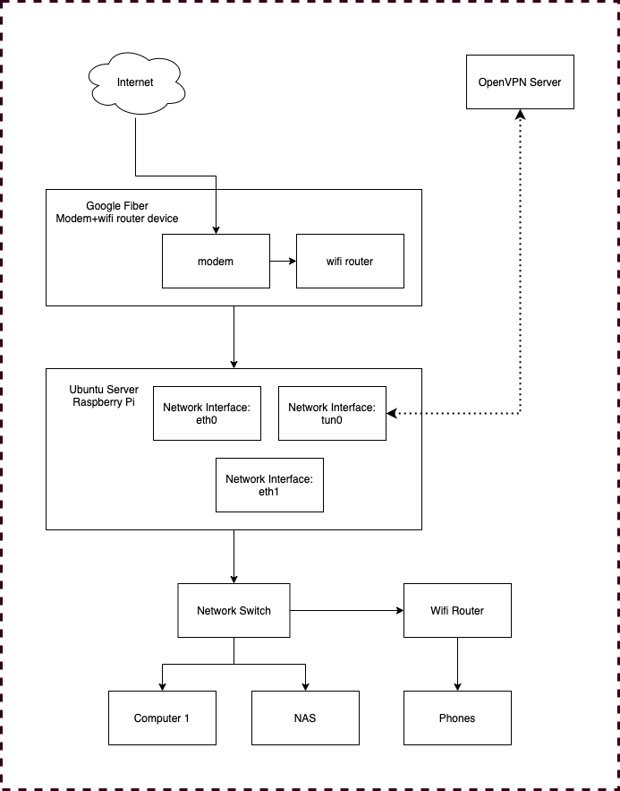
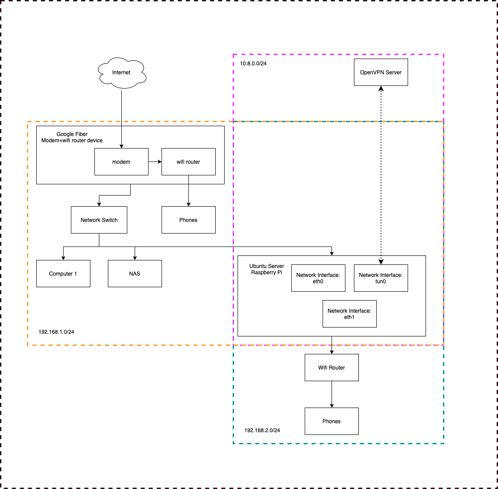
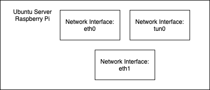
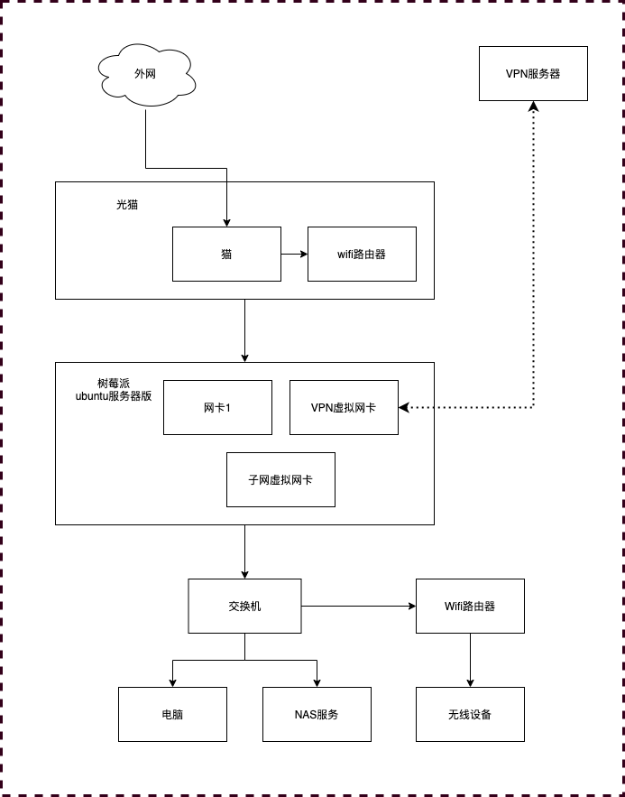
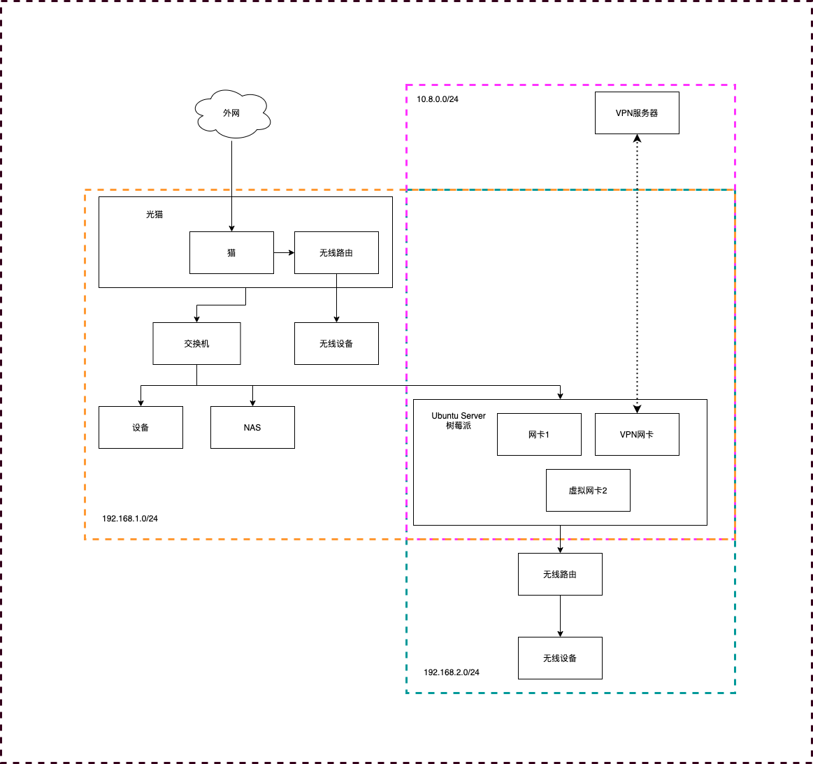
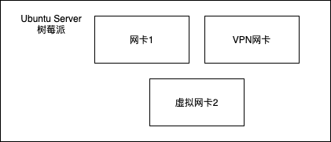

# Routing with ubuntu server

## Goal & Requirement
1. I bought a NAS, I am going to use it to do backups, in the meantime, enhance the whole networks.
2. I have an VPN server, I hope I could use that to access home service from outside, instead of using DDNS or static ip.
3. I wish to open some service from my home networks, eg: vs code server, jupyter notebook server, so that I only need chrome for mobile devices. And for some small projects like this blog project, I could put the code in the server and use one machine to maintain the blog.

## Design
### Old Design and Problem


The old design is showed above,  
Solution is to used a server to run ubuntu as a middle router, and it needs to provide:
1. connection with the outside internet
2. connection with the VPN server
3. provide dhcp assignment for inner-network

Speed become the biggest problem of this. I found that OpenVPN has a speed limit here, normally 100Mbps is the limits. That is unacceptable. And the VPN server is not physically near my home, there already lag, but I thought I could do compromise about the lag. But not the speed, never compromise the speed.

### New Design and solution


The new design is showed above:  
The solution is to separate the whole inner-network into three parts:
1. modem will assign/lease the ips of 192.168.1.xxx, this will be used for most the device to connect to the internet, it is a full speed network.
2. raspberry pi will assign/lease the ips of 192.168.2.xxx, which will be used to auto connect to VPN, it is a limited speed network.
3. vpn server will assign/lease ips of 10.8.0.xxx. Inner service will be open to this network.

So, if want to get full speed, choose modem network, if want to get vpn, choose raspberry network. Raspberry pi will forwarding ports to VPN networks, so when connection from VPN, they could access inner-network service. And even though we expose this service, they are still inside the VPN, so it is very safe.


## ubuntu useful tools
As we mentioned before, the core of this design is in the raspberry pi. There are many manipulate on the ubuntu server in raspberry. I read a lot to learn this. So I have this part as a reference for next steps, here we will talk about some tools for future use.

### crontab
[cron](https://en.wikipedia.org/wiki/Cron)is a very common ubuntu command for timer behavior. It provide a trigger, so at a certain time, it could trigger a action. We introduce it here because it has a config option @reboot, which could be used to add some command at the time of the server boot up, this is much easy to create a ubuntu service to do the same thing. 

install：
```
apt-get install cron
```
run this
```
crontab -e
```
add this line in the file：
```
@reboot Your-Command
```

### screen
This is a very common ubuntu tool for running a long-live service, it will help you to keep a service alive, even when you close the terminal.  
Here are some common command：
1. Check all exist screens
```
screen -ls
```
2. Add a detached screen and run a command
```
screen -dmS sessionName command
```
3. Connect back to detached screen
```
screen -x sessionName
```
Three command will be enough for now.

### openvpn
[Install openvpn server in your machine](https://www.digitalocean.com/community/tutorials/how-to-set-up-an-openvpn-server-on-ubuntu-16-04) is this a very good blog from digital ocean, to set up a openvpn server.

openvpn client:  
This command will help you to start the client, still you will need to provide configs and password before execution.
```
sudo openvpn --config xx.ovpn --askpass pass.file
```

### ubuntu netplan && network
If you used ubuntu desktop and change to ubuntu server, you will find this netplan is introduced after 16.04(?) and replace of the network. Still you could change back to edit /etc/networks/interfaces with some extra settings, but we will talk about netplan here.  
netplan provides some configs in different files.
```
00-installer-config.yaml
50-cloud-init.yaml
```
And you can use one command to create combined rules for test run
```
sudo netplan --debug generate
```
At the end you could apply the rules
```
sudo netplan apply
```

And each file is a yaml file，there is a example for a static ip connection setting：
``` Yaml
network:
    ethernets:
        eth0:
            addresses:
                - 192.168.1.2/24
            gateway4: 192.168.1.1
            nameservers:
                addresses:
                    - 8.8.8.8
version: 2
```

### iptables
iptables is used to setup ip transfer and port forwarding.  
Let's see some example of the command for iptables.
#### check
When you need to check the nat status
```
sudo iptables -t nat -vnL
```

#### POSTROUTING && PREROUTING
When you need to set routings:
```
sudo iptables -t nat -A POSTROUTING -o tun0 -j MASQUERADE
sudo iptables -t nat -A PREROUTING -p tcp --dport 21 -j DNAT --to-destination 192.168.1.2:21
```
The first one means that, when all the connection in the post-routing status, set them to handled by network interface tun0. So that all the network will pass to tun0 to handle.  
The second one means in the phrase of pre-routing, forwarding all the request for port 21 to port 21 in 192.168.1.21.

And if you want to delete the rule above when you make some mistakes, simply change A to D here
```
sudo iptables -t nat -D POSTROUTING -o tun0 -j MASQUERADE
sudo iptables -t nat -D PREROUTING -p tcp --dport 21 -j DNAT --to-destination 192.168.1.200:21
```

## Implementation
I followed this blog to start, and did some adjustments on my own：
[Base](https://medium.com/@exesse/how-to-make-a-simple-router-gateway-from-ubuntu-server-18-04-lts-fd40b7bfec9)

1. Change ip
2. Set up dhcp server
3. Config ip transfer
4. Setting NAT routing

Most of the steps are the works for me in 1-3 steps, and I will need to do some more the step 4.

### How I setup my NAT routing rules
Let's talk about network interfaces first  
  
I have three network interfaces, they are represent to three networks, two of them set in netplan, and tun0 is created automatically when vpn connection set up:
- eth0 is used for 192.168.1.xxx
- tun0 is the vpn, used for 10.8.0.xxx
- eth1 is used for 192.168.2.xxx

And my post-routing is very easy, like this:  
```
Chain POSTROUTING (policy ACCEPT 14213 packets, 1060K bytes)
 pkts bytes target     prot opt in     out     source               destination
   39  2702 MASQUERADE  all  --  *      eth0    0.0.0.0/0            192.168.1.0/24
    2    96 MASQUERADE  all  --  *      eth1    0.0.0.0/0            192.168.2.0/24
 4101 2089K MASQUERADE  all  --  *      tun0    192.168.2.0/24       0.0.0.0/0
```
Some explains:  
- For all connection target 192.168.1.xxx they will be change to eth0 to handle
- For all connection target 192.168.2.xxx they will be change to eth1 to handle
- The rest will go to tun0
First two will used in port forwarding next, the last one is used for inner network connection

Then you could use command like this ```sudo iptables -t nat -D PREROUTING -p tcp --dport 21 -j DNAT --to-destination 192.168.1.2:21``` to do port forwarding. Here I forwarding connection to port 21 to 192.168.1.2

### How to save all routing settings persistently
First of all, beside tun0, all the rest settings could saved as the blog talked before using iptables-persistent. [Base](https://medium.com/@exesse/how-to-make-a-simple-router-gateway-from-ubuntu-server-18-04-lts-fd40b7bfec9) the only problem is, when updating the rules, I have to reinstall iptables-persistent and saved again, otherwise it wont saved, I dont know whether this is a bug.  
However, this cannot work for rules related to tun0, because tun0 only exist when the VPN connection is established. So if you saved the operation above, when you do the restarting, it will auto change will is tun0 to eth0.
```
Chain POSTROUTING (policy ACCEPT 14213 packets, 1060K bytes)
 pkts bytes target     prot opt in     out     source               destination
   39  2702 MASQUERADE  all  --  *      eth0    0.0.0.0/0            192.168.1.0/24
    2    96 MASQUERADE  all  --  *      eth1    0.0.0.0/0            192.168.2.0/24
 4101 2089K MASQUERADE  all  --  *      eth0    192.168.2.0/24       0.0.0.0/0
```

So what we will do is to used auto start to start VPN client first, then add the NAT routing rule. The way to do it is to use ```crontab -e``` to add a command to do execution.  
```
@reboot bash /home/xxx/start-client.sh
```
And the file /home/xxx/start-client.sh is like:
```
screen -d -m -S openvpn sudo openvpn --config /home/xxx/xxx.ovpn --askpass /home/xxx/openvpnpass.txt
sleep 10
sudo iptables -t nat -A POSTROUTING -s 192.168.2.0/24 -o tun0 -j MASQUERADE
```

## Some tips
When you try to setup network, you might lose the connection to the server if you make mistakes. Before this I didnt bought the hdmi cable for raspberry pi, so I have to reset it several times to get connection back. So I highly recommend you put a plan B here when network connection broken, use a hdmi to change the mistake back.  
Also, when you do some changes for the whole networks, you might still have a wifi connection from the top level. So if connection is error, you still have a connection to the internet from wifi, you can still do some search on the problem. And it will be easy to set it back when you finished.


---

# ubuntu server实现路由

## 目标和需求
1. 买了一个nas，想用来做备份，加强一下家庭网络
2. 有一个自己的vpn服务器，想用这个代替公网IP/DDNS，来做家庭网络的户外接入
3. 想在内网开放一些服务，比如vs code的服务器端，或者jupyter notebook这类的服务器端，这样移动设备只需要chrome，而且处理blog的代码也就可以放在一处了。

## 设计
### 旧设计与问题
 

旧设计如图，
思路是用一台跑ubuntu server的服务器作为中间的路由器。它能够：
1. 连接外网
2. 连接VPN服务器
3. 提供内网的ip分配

实现下来发现最大问题是网速。我使用的OpenVPN的网速是有上限的，100Mbps是一般情况下的极限。这个网速是完全不够的，况且本身vpn服务器的地理位置也不是我目前家里的位置，延迟本就很高，本来还想勉强接受一下延迟，但是这个网速肯定不行。

### 新设计与解决问题
 

新设计如图：
思路是将整体分为三个部分：
1. 光猫分配192.168.1.xxx网段，作为大多数设备的主要上网网段，这个网段是全速的。
2. 树莓派分配的192.168.2.xxx网段，作为自动连接vpn的网段，这个网段是vpn的。
3. vpn服务器分配的10.8.0.xxx网段，作为外部连接连回时候使用的网段，这个网段主要是要开放内网服务的。

这样解决的是，如果内网要全速就走光猫网段，如果要vpn就走树莓派网段，换个无线连接就可以了。树莓派上面转发内网的服务给vpn网段，这样在外面连上vpn就可以用内网的服务了，这些服务虽说是暴露，但其实是面向vpn内网的，也比较安全。此外树莓派我是买一个usb网络转换器的。

## ubuntu server有关的工具
如图所示，我们的核心就是被色彩包围的树莓派的操作，这部分涉及很多ubuntu server的尝试。我也是看了很多资料，边看边学。这部分先整理一下，主要围绕很多必要的工具的介绍和使用方法。

### crontab
[cron](https://en.wikipedia.org/wiki/Cron)是一种常用的ubuntu定时执行命令的工具。它提供一种触发，在某个时间点，能够执行一个动作。这里提到它是因为它有一个@reboot的选项，可以用来插入一段命令，做ubuntu的自启动。这个的配置比写ubunt的服务要方便的多。

安装：
```
apt-get install cron
```
运行这个
```
crontab -e
```
然后在文档里面添加：
```
@reboot Your-Command
```


### screen
ubuntu里面非常常用的跑常驻程序的工具，它让你不会因为终端的断开就结束运行着的程序。  
这里介绍几个命令：
1. 检查已有的screen
```
screen -ls
```
2. 添加一个screen并运行命令，且离开
```
screen -dmS sessionName command
```
3. 连接screen
```
screen -x sessionName
```
有了这里的几个命令就可以很快上手screen


### openvpn
首先是服务器部分，digital ocean有一个很好的openvpn server搭建的[教程](https://www.digitalocean.com/community/tutorials/how-to-set-up-an-openvpn-server-on-ubuntu-16-04)。我就不在多言。

openvpn客户端:
一条命令可以让客户端跑起来。当然你要把配置和密码存好
```
sudo openvpn --config xx.ovpn --askpass pass.file
```

### ubuntu netplan && network
如果你用过ubuntu桌面版，再使用ubuntu服务器版，就会发现，可能是16.04以后新引入了netplan的写法代替了network的default写法。当然可以取消掉netplan的配置仍然编辑/etc/networks/interfaces，不过这里说一下我理解的netplan的配置。  
netplan提供了不同等级的配置文件：
```
00-installer-config.yaml
50-cloud-init.yaml
```
之后使用命令来生成一个综合了以上规则的plan
```
sudo netplan --debug generate
```
最后在用apply来实现
```
sudo netplan apply
```

具体写法是yaml语法，这里给一个网络接口与静态ip设置的简单例子：
``` Yaml
network:
    ethernets:
        eth0:
            addresses:
                - 192.168.1.2/24
            gateway4: 192.168.1.1
            nameservers:
                addresses:
                    - 8.8.8.8
version: 2
```

### iptables
iptables是用来做ip变换的设置工具。  
iptables的一般规则使用方法如下，但也不是所有的选项在一条命令内都存在：  
```iptables [-t 表名] <-A|I|D|R> 链名 [规则编号] [-i|o 网卡名称] [-p 协议类型] [-s 源ip|源子网] [--sport 源端口号] [-d 目的IP|目标子网] [--dport 目标端口号] [-j 动作]  ```


其中动作的选择有：
```
ACCEPT          接收数据包
DROP             丢弃数据包
REDIRECT      将数据包重新转向到本机或另一台主机的某一个端口，通常功能实现透明代理或对外开放内网的某些服务
SNAT             源地址转换
DNAT             目的地址转换
MASQUERADE       IP伪装
LOG               日志功能
```
以及操作类型的解释
```
-A 增加
-I 插入
-D 删除
-R 替换
```

我们来看一些具体的例子
#### check
当你需要查看nat的情况时
```
sudo iptables -t nat -vnL
```

#### POSTROUTING && PREROUTING
当你需要设置routing操作的时候
```
sudo iptables -t nat -A POSTROUTING -o tun0 -j MASQUERADE
sudo iptables -t nat -A PREROUTING -p tcp --dport 21 -j DNAT --to-destination 192.168.1.2:21
```
第一条的意思是将所有的信息在postrouting过程中，将出口设置为tun0网卡来处理。这样所有的网络都会通过tun0网卡来发送。  
第二条的意思是在prerouting阶段，对该服务器的21端口的请求转发到192.168.1.2的21端口上

如果你要删去上述两条：
```
sudo iptables -t nat -D POSTROUTING -o tun0 -j MASQUERADE
sudo iptables -t nat -D PREROUTING -p tcp --dport 21 -j DNAT --to-destination 192.168.1.200:21
```

## 具体实现过程
我的实现，是这位大神实现的一个扩展：
[Base](https://medium.com/@exesse/how-to-make-a-simple-router-gateway-from-ubuntu-server-18-04-lts-fd40b7bfec9)

1. 修改ip
2. 配置dhcp
3. 配置ip转发
4. 设置NAT routing

其中前三项基本没有什么改变，所有的额外操作都在第四条的时候。

### 如何设置我的NAT routing规则
首先是网卡  
  
我有三张网卡，对应着三个不同的子网，这些配置在netplan之中设置好了（tun0是vpn client自动生成的）：
- 网卡1是eth0，对应 192.168.1.xxx
- vpn是tun0，对应 10.8.0.xxx
- 网卡2是eth1，对应 192.168.2.xxx

然后我的post routing很简单
```
Chain POSTROUTING (policy ACCEPT 14213 packets, 1060K bytes)
 pkts bytes target     prot opt in     out     source               destination
   39  2702 MASQUERADE  all  --  *      eth0    0.0.0.0/0            192.168.1.0/24
    2    96 MASQUERADE  all  --  *      eth1    0.0.0.0/0            192.168.2.0/24
 4101 2089K MASQUERADE  all  --  *      tun0    192.168.2.0/24       0.0.0.0/0
```
解释一下，
- 所有目的地是 192.168.1.xxx 这类的请求走eth0，
- 所有目的地是 192.168.2.xxx 的请求走eth1，
- 剩下的从内网发出来的信息走tun0。
前两条为之后实现内网端口转发作准备，后一条是实现内网都是vpn连接

然后就是用类似这样的请求 ```sudo iptables -t nat -D PREROUTING -p tcp --dport 21 -j DNAT --to-destination 192.168.1.2:21```把你要转发的端口转发出去

### 如何永久保存routing信息
首先跟tun0无关的所有信息都是可以利用[Base](https://medium.com/@exesse/how-to-make-a-simple-router-gateway-from-ubuntu-server-18-04-lts-fd40b7bfec9)这里的方法进行保存，即iptables-persistent来保存，不过我这里有一个问题，每次更新的时候我需要重装iptables-persistent，再保存，不然就会消失。我不请求是不是bug。  
不过跟tun0有关的信息就不能这样了，因为tun0只有在vpn启动的时候才会出现，所以如果你保存了上述的操作，重启后，会看到默认把tun0的地方改成eth0
```
Chain POSTROUTING (policy ACCEPT 14213 packets, 1060K bytes)
 pkts bytes target     prot opt in     out     source               destination
   39  2702 MASQUERADE  all  --  *      eth0    0.0.0.0/0            192.168.1.0/24
    2    96 MASQUERADE  all  --  *      eth1    0.0.0.0/0            192.168.2.0/24
 4101 2089K MASQUERADE  all  --  *      eth0    192.168.2.0/24       0.0.0.0/0
```

所以我们要利用自启动来启动vpn，再增加这条命令。具体就是利用crontab添加一条执行，执行内容是openvpn，并且写入nat  ```crontab -e``` 添加
```
@reboot bash /home/xxx/start-client.sh
```
具体执行脚本/home/xxx/start-client.sh:
```
screen -d -m -S openvpn sudo openvpn --config /home/xxx/xxx.ovpn --askpass /home/xxx/openvpnpass.txt
sleep 10
sudo iptables -t nat -A POSTROUTING -s 192.168.2.0/24 -o tun0 -j MASQUERADE
```

## 额外的坑
调试网络很麻烦的点就是网络配置错了，就连不上了。我当时没有买视频线，所以重置了几次树莓派。比较建议一定要用视频线直接连接，你在尝试的时候指不定就掉了。  
此外，在做全局调整的时候也要用wifi先保证一个点可以接入互联网，这样也方便查阅资料，不然总机网络错了全部都连不上了。